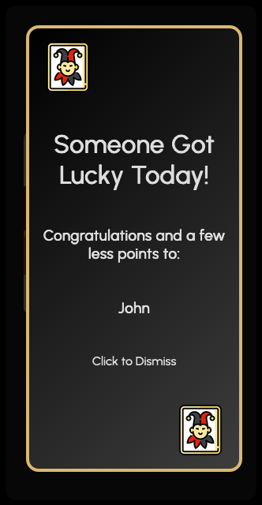

# Yaniv Score Tracker

## Table of Contents

-   [Introduction](#introduction)
-   [Features](#features)
-   [Usage](#usage)
-   [Contributing](#contributing)
-   [License](#license)

## Introduction

This is my first React Project made from scratch. It's still a working in progress as I plan to add authentication and other features as I progress on my learning journey.

That's personally a very meaninful project because is part of something me and my friends have a lot of fun doing. And in this process we ended up having our own rules and way to play the game, that is slightly different from the original rules.

The project is a score tracker for the game Yaniv. It allows players to track scores, apply game rules to the scores, and view various statistics related to the game and the current session.

## Features

-   Automatic score calculation as you add scores
-   Adherence to Yaniv game rules for score adjustments
-   Comprehensive display of game statistics
-   Real-time tracking of the current session's progress

## Usage

You can acess the deployed version [here](https://yaniv-score.netlify.app/).

    
    

I haven't implement an authentication method yet. But the app is fully functional. Just create a new game with your desired name and password.
Or login to an existing game you created before.
Note: Since I am still building and looking for bugs, it's not 100% guaranteed that your game data will be accurate. However, the initial tests haven't showed any problem. So you can start using it today to record your Yaniv Games Scores.

### Wrong Inputs:

    

Wrong Inputs will be Warned with a modal. To avoid weird or off data. If you face any error that's not a mispelling or wrong input type, please contact me and i'll do my best to find and fix it.

### Objective:

The main objective of Yaniv is to have the lowest total points in your hand when someone else calls "Yaniv."

### Setup:

1. **Deck**: Use a standard 52-card deck with Jokers.
2. **Deal**: Each player is dealt 7 cards.

### Gameplay:

1. Players take turns clockwise.
2. On a player's turn, they can either:

    - **Discard a Set**: In order to get rid of points the player can discard sets of cards. Valid Sets are explained on the next topic.
    - **Draw a Card**: Either the top card from the discard pile or an unknown card from the deck.
    - **Call Yaniv**: If a player thinks they have the lowest total points, they can call "Yaniv" to end the round.
    - Players can only call Yaniv when they have less than 5 points

### Scoring:

1. **Card Values**:

    - Number cards (2-10): Face value in points.
    - Face cards (King, Queen, Jack): 10 points each.
    - Ace: 1 point.
    - Joker: 0 point.

2. **Valid Sets**:

    - **Group**: Three or four cards of the same rank (e.g., 3 sevens or 4 jacks).
    - **Run**: Three or more consecutive cards (e.g., 3, 4, 5).

3. **Round End**:

    - If a player calls "Yaniv," all players reveal their hands.
    - If the player who call "Yaniv" has the lowest total points he/she wins the round and get zero points.
    - If the player who call "Yaniv" does not have the lowest total points he/she loses and get 30 plus the points he has in hand added to his score.

4. **Penalty Points**:

    - Each player scores points based on the remaining cards in their hand.

### Winning the Game:

-   The game is usually played over multiple rounds, and the player with the fewest points at the end of a predetermined number of rounds is declared the overall winner.

-   For this score tracker there's no limit of rounds, so you can keep playing for as long as you want. That's also why we track sessions.

-   The tracker will highlight in yellow the players with lowest points.

-   The tracker will add a yellow corner sign for the last round winner.

### Inputting Scores

    
    

Each player has a line with the last three scores and an input field in the end. Just add the numbers left on each player hand and press the "+" button at the bottom. The App will automatically calculate the sum or deduction of points. And will also display a message if any player matchs the "multiple of rule" (deduced points).

### Viewing Statistics

    
    

The Statistics are easy to read and acess. They are divided in two: Current Session Statistics and Overall Game Statistics

## Contributing

If you like this project and want to contribute or give any feedback. I am super open to to hear your thoughts and make it better.

## License - MIT

Copyright (c) 2023 Thiago Tavares Freire

[SvgRepo](https://www.svgrepo.com/svg/444064/legal-license-mit)
